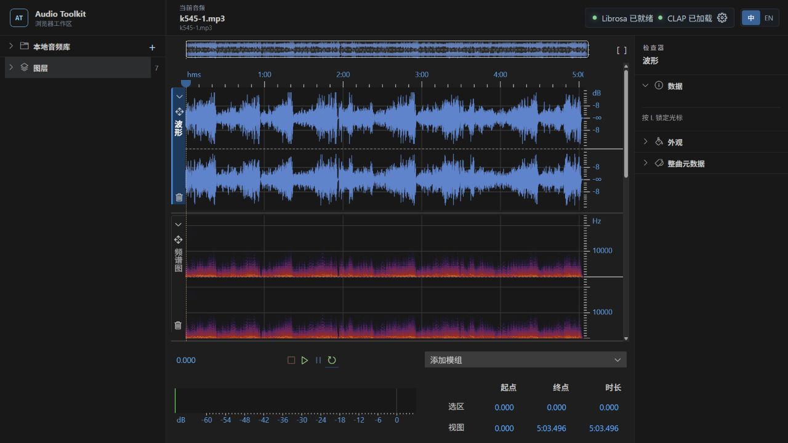
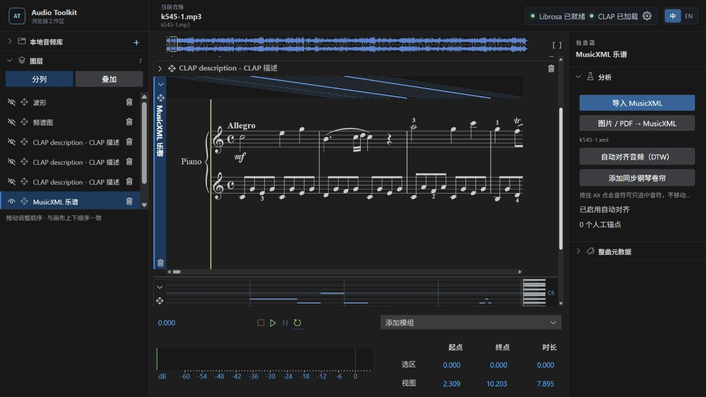
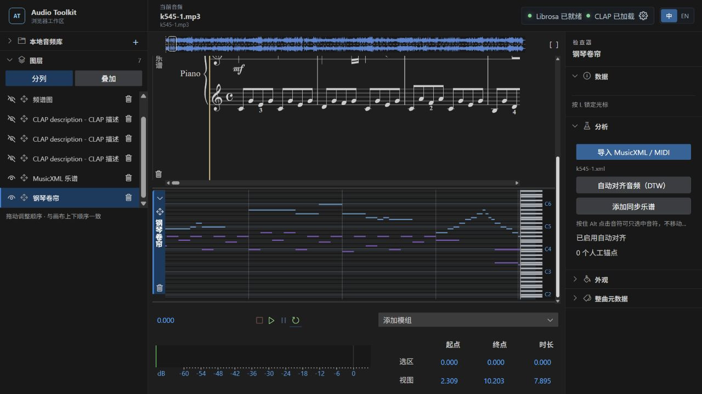

# Audio Toolkit Web

[中文](README.zh-CN.md) · [Detailed setup](STANDALONE.md) · [Release checklist](docs/RELEASING.md)

A modular, interactive workspace for listening to, analysing and annotating
audio alongside its score. Runs as a standalone web application—no VS Code
installation or extension host required.



*Mozart, Piano Sonata No. 16 in C major, K.545, first movement: a real local
recording on the shared waveform/spectrogram timeline.*

## Features

- **One timeline:** synchronized playback, cursor, selection, zoom and data
  inspection. Stack modules in columns or overlay them with layer ordering,
  visibility and opacity controls.
- **Editable annotations:** named point/range markers, beat/onset and region
  candidates. Saved manual edits survive reopening.
- **Shared renderers:** Vector curves, Matrix heatmaps and Markers; Canvas2D /
  WebGL matrices, colormaps and color ranges. Analysis and appearance are separate.
- **Librosa + native Essentia:** RMS, pitch, spectral descriptors, MFCC, Mel,
  chroma and more. 29 native DSP modules and 21 Essentia TensorFlow views for
  instruments, mood/theme, genre, timbre, music tags and audio-estimated tempo.
- **Text/audio matching:** CLAP/MuLan context descriptions and raw prompt
  matches; keyword-relevance curves progressively display completed results.
- **Score + performance:** a horizontally scrolling single-system MusicXML
  score, DTW audio alignment and manual anchors; synchronized MIDI/MusicXML piano
  roll with track visibility, piano keys and note labels. Backend OMR imports
  images/PDFs as MusicXML.
- **Music-level information:** score-assisted metadata, editable region modules,
  V/A curves, notated tempo and separate DTW-derived performed tempo. Suggestions
  do not silently overwrite manually entered metadata.
- **Local workspaces:** folder browsing, retained browser handles and
  `.audio_toolkit/` persistence for analyses, modules, scores and annotations.
  Workspace documents can be exported/imported. English and Chinese UI.



*The single-system score follows the playhead. Alignment connectors link audio
time to score positions; estimated DTW can be corrected with manual anchors.*



## Quick start

Use Chrome or Edge for the local-folder workflow. CI uses Node 22.

Frontend only, with no Python required:

```sh
git clone https://github.com/fr0stbyter/vscode-audio-toolkit.git
cd vscode-audio-toolkit
npm ci --prefix app
npm run dev
```

Open Vite's printed URL (normally `http://127.0.0.1:5173/`). Choose **Open folder**
or **Open audio file**. Playback, waveform, browser spectrogram, manual markers,
MusicXML and piano roll run in the browser.

For analysis, clone [music-embedding-analysis](https://github.com/Fr0stbyteR/music-embedding-analysis)
beside this repository and start both services:

```powershell
# Windows
.\start-standalone.ps1
```

```sh
# macOS
bash start-standalone.command
```

Normal first startup prepares/verifies dependencies, native Essentia, VA and
TensorFlow models; it requires internet and disk space. Later launches reuse
installed artifacts. Windows native inference is tested; macOS adapters and
real-model integration CI are configured, not a claim that every model has
been locally verified on a Mac. On Windows, `-MusicBackendPath <path>` selects
a different backend folder.

Backend `.env` controls Python/model options. `app/.env.example` documents
frontend defaults; header settings select a local/remote backend. Librosa,
learned-model analysis and OMR need the backend. **Never embed private tokens in
public builds:** `VITE_*` values are readable JavaScript. See [security](SECURITY.md).

## Try K545

1. Open your own recording and import its matching score into a MusicXML module.
2. Run **Auto-align to audio (DTW)**, then **Add synchronized piano roll**.
3. Zoom into a phrase and move the playhead to inspect synchronization. Correct
   performance/repeat mismatches with manual anchors.
4. Add performed-tempo, analysis or region modules and save the workspace locally.

Screenshots use local `k545-1.mp3`/`k545-1.xml`. The recording and score files are
not redistributed. The local score identifies `www.antescofo.com`; see
[media attribution](THIRD_PARTY_NOTICES.md) and supply your own lawful media.

## Build and release

```sh
npm run check           # lint, regression tests, production build
npm run preview         # serve dist/ locally
npm run release:prepare # check, public build, notices + corresponding sources
```

Output is `dist/`, including license notices and `source/`. First release
preparation downloads checksum-verified FFTW/Verovio source archives. See
[rebuilding instructions](docs/CORRESPONDING_SOURCE.md).
Serve it through HTTP locally or HTTPS in production, not
`file://`. Static hosting and the backend are separate. CI checks Linux,
Windows and macOS and uploads a build artifact; it does not automatically
publish a GitHub Release or deploy a site. See [release checklist](docs/RELEASING.md)
and [contributing](CONTRIBUTING.md).

## Limits and licensing

Model scores, candidates, inferred form, DTW and OMR require human review.
Window-level models do not imply note-level precision. File System Access
support/permissions vary by browser.

The frontend is **GPL-3.0-or-later** licensed; see [LICENSE](LICENSE). FFTW is
GPL, Verovio is LGPL, and icons, fonts and backend weights retain their own terms.
Source and build instructions must accompany distributed builds. Read
[THIRD_PARTY_NOTICES.md](THIRD_PARTY_NOTICES.md) before redistribution or
commercial deployment. No third-party component is relicensed by this README.
